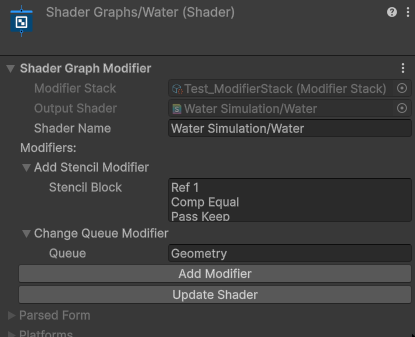

# Shader Graph Modifier
This Unity editor tool adds additional features (like stencil buffers) to shader graphs.
It works, by generating the ShaderLab code and injecting some additional code into it.
The shader is automatically updated when saving changes in the shader graph.

    

Supported features are:
- Renaming the shader
- Changing its group (normally all shader graphs are listed under `Shader Graphs/...`)
- Use of stencil buffers
- Modifying the rendering queue (e.g. `Geometry+1`)

## How to Use
Press the `Create Modifier Stack` button in the inspector of any shader graph.

This will create two files:
- `ShaderLab` (`<name>_Modified.shader`): Modified shader that needs to be used for materials instead of `<name>.shadergraph`
- `Modifier Stack` (`<name>_Modifier Stack.asset`): File that stores the modifications

Changes to the modifiers can now be made in the shader graph's inspector.

## Setup
Installation using the Package Manager:
1. Click on the `+` in the `Package Manager` window
2. Chose `Add package from git URL...`
3. Insert the following URL `https://github.com/JonasWischeropp/unity-shader-graph-modifier.git`  
A specific [release](https://github.com/JonasWischeropp/unity-shader-graph-modifier/releases) version can be specified by appending `#<version>` (e.g. `...ifier.git#1.0.0`).
4. Press the `Add`-Button

## Additional Info
- More features can simply be added by extending the `Modifier` class.
- Files are addressed by GUID, feel free to rename/move them
